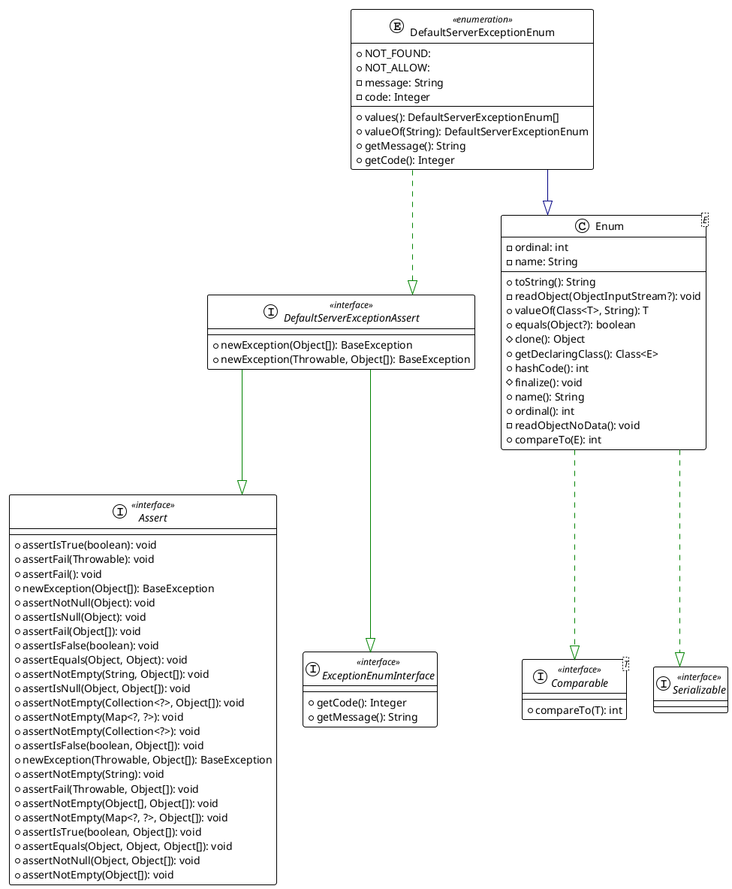
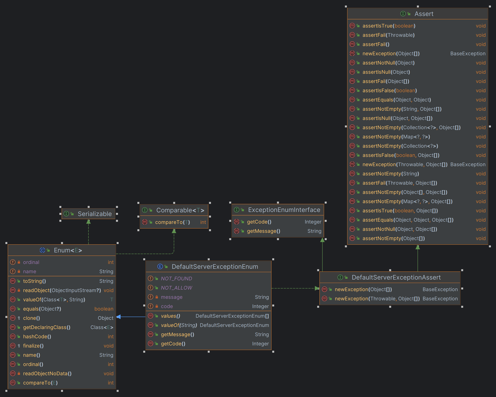

# 异常断言公共类
```text
assert-common
├───src
│   ├───main
│   │   ├───java
│   │   │   └───club
│   │   │       └───akuo
│   │   │           └───common
│   │   │               ├───defaults    #默认实现
│   │   │               ├───exceptions  #异常
│   │   │               └───interfaces  #接口
│   │   └───resources
│   └───test
│       └───java
│           └───club
│               └───akuo
│                   └───common
│                       └───defaults    #测试用例


```




>public.return.api:api接口所在的包
>
> 在此包下面的返回值会自动包装 如果想忽略某个接口返回不进行包装可以添加注解 @IgnoreUnified
>

通过继承断言和Enum接口的断言枚举实现断言和异常返回
